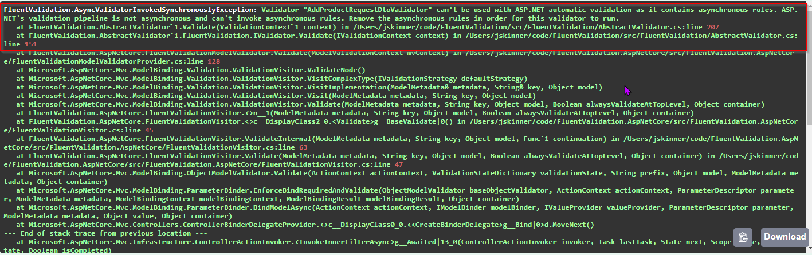
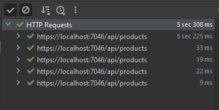

# Using asynchronous validators in ASP.NET

## Context

My friend @Ben (https://github.com/bmazzarol) and myself came across an interesting problem to fix, when upgrading our APIs to latest .NET and upgrading their respective packages.

Validation is crucial when designing APIs, and we are using the wonderful `FluentValidation.AspNetCore` in our APIs. 
How it seamlessly allow the engineers to define the validations, and integrate with the ASP.NET echo system is a breeze.

Some of our validators contain asynchronous validations, and after upgrading we got this error.



The error clearly states that our validators contain `asynchronous` validations, and the ASP.NET validation pipeline is not asynchronous and hence can't invoke asynchronous rules.

_Yes, it can be debated that validations must be synchronous, but in reality there are many situations where certain validations have to be asynchronous, such as validating with a data store entry or with a web service.
Also it can be the opinion, that such actions should be the responsibility of the core layer(application / domain), but this was existing code, and in our opinion the approach was correct :relaxed:_  

## Considered options

* Move the `async` validations from the validators, and move it to the application or the business layer.
  * Then we will have to create another level of abstraction to be injected into the controller or the core layers.
  * We will need to change all our existing validators.
  * We will lose all the "async" validations performed at the time of model binding.


* Implementing a custom action filter 
  * This should be able to perform `asynchronous` operations.
  * Should be able to use the existing validators without any change.
  * Must be able to find and create the respective `IValidator` for the requested type, and perform the validations.
  * If there were validation errors, short circuit the ASP.NET pipeline and return `ProblemDetails` as an error response.

:bulb: We chose to create a custom action filter

## Demonstrating the problem, with a sample API

This is an API to manage products. For the sake of brevity I have created only a single endpoint which simulates an adding of a product.

* The registration of FluentValidation in ASP.NET
```csharp
public static class Bootstrapper
{
    public static void RegisterDependencies(WebApplicationBuilder builder)
    {
        // register fluent validation as part of the ASP.NET pipeline
        builder.Services.AddValidatorsFromAssembly(typeof(Program).Assembly)
            .AddFluentValidationAutoValidation();
        
        builder.Services.AddSingleton<ICreateProductService, CreateProductService>();
    }
}
```
In the `Program.cs` we register the dependencies.
```csharp
using Demo.Products.Api;

var builder = WebApplication.CreateBuilder(args);

// Add services to the container.

builder.Services.AddControllers().AddHybridModelBinder();
Bootstrapper.RegisterDependencies(builder);
...
...
```

* The `Validator` for the DTO
```csharp
public class AddProductRequestDtoValidator : ModelValidatorBase<AddProductRequestDto>
{
    public AddProductRequestDtoValidator()
    {
        RuleFor(x => x.Id).NotNull().NotEmpty().WithMessage("id is required");
        RuleFor(x => x.Name).MustAsync(async (s, token) =>
        {
            // simulating an asynchronous call
            await Task.Delay(TimeSpan.FromSeconds(1), token);
            return !string.IsNullOrWhiteSpace(s);
        }).WithMessage("name is required");
    }
}
```

* The action method which will expose the endpoint
```csharp
[ApiController]
public class CreateProductsController : ControllerBase
{
    private readonly ICreateProductService _service;

    public CreateProductsController(ICreateProductService service)
    {
        _service = service;
    }

    [HttpPost("api/products")]
    public async Task<IActionResult> AddProduct([FromHybrid] AddProductRequestDto request)
    {
        var addProductRequest = new AddProductRequest(request.Id, request.Name, request.Price);
        var status = await _service.ExecuteAsync(addProductRequest);
        return status ? Ok() : StatusCode((int) (HttpStatusCode.InternalServerError));
    }
}
```

*Note that I have used another Nuget package called `HybridModelBinding` to bind the model from different model binders and value providers.
As you can see below the DTO is getting populated by both from the header and from the body. Hybrid model binding is not relevant to the validations, but wanted to demonstrate that since the validation approach must happen after the model binding*.

```csharp
[HybridBindClass(new []{Source.Header, Source.Body})]
public class RequestDto
{
    [HybridBindProperty(Source.Header, name: "X-Correlation-ID")]
    public string CorrelationId { get; set; }

    public string Id { get; set; }
    public string Name { get; set; }
    public decimal Price { get; set; }
}
```

When you run this project, and make an HTTP POST request to this endpoint, you'll get the above mentioned error.

## Custom action filter to validate DTOs

When designing the solution, we wanted to design, and implement the filter to be used with our many other APIs.
So we could make this as a common library such as a nuget package to be used.

```csharp
public class ApiValidationFilter : IAsyncActionFilter
{
    private readonly ICustomValidatorFactory _validatorFactory;

    public ApiValidationFilter(ICustomValidatorFactory validatorFactory)
    {
        _validatorFactory = validatorFactory;
    }
    
    public async Task OnActionExecutionAsync(ActionExecutingContext context, ActionExecutionDelegate next)
    {
        if (!context.ActionArguments.Any())
        {
            await next();
            return;
        }

        var validationFailures = new List<ValidationFailure>();

        foreach (var actionArgument in context.ActionArguments)
        {
            var validationErrors = await GetValidationErrorsAsync(actionArgument.Value);
            validationFailures.AddRange(validationErrors);
        }

        if (!validationFailures.Any())
        {
            await next();
            return;
        }

        context.Result = new BadRequestObjectResult(validationFailures.ToProblemDetails());
    }
    
    private async Task<IEnumerable<ValidationFailure>> GetValidationErrorsAsync(object value)
    {
        
        if (value == null)
        {
            return new[] {new ValidationFailure("", "instance is null")};
        }

        var validatorInstance = _validatorFactory.GetValidatorFor(value.GetType());
        if (validatorInstance == null)
        {
            return new List<ValidationFailure>();
        }

        var validationResult =await validatorInstance.ValidateAsync(new ValidationContext<object>(value));
        return validationResult.Errors ?? new List<ValidationFailure>();
    }
}
```

* Inject an `ICustomValidatorFactory` which will get the respective `IValidator` instance.
* Implement the `IAsyncActionFilter` interface and it's `OnActionExecutionAsync`.
  * For each action argument's object type, get the validator instance if available.
  * Use that validator instance to `ValidateAsync`. We are using `ValidateAsync` because it will validate both `synchronous` and `asynchronous` validations on the object.
  * Return validation errors if there are any.
  * If there are validation errors, return the `ProblemDetails` response and short circuit the ASP.NET pipeline.

**Extension method to return `ProblemDetails` from `ValidationFailure`s**

It's pretty straight forward, it will create a `ProblemDetails` instance and, adds the "errors" in the `ValidationFailure` instance to it.
```csharp
public static class ValidationResultExtensions
{   
    public static ProblemDetails ToProblemDetails(this IEnumerable<ValidationFailure> validationFailures)
    {
        var errors = validationFailures.ToDictionary(x => x.PropertyName, x => x.ErrorMessage);
        
        var problemDetails = new ProblemDetails
        {
            Type = "ValidationError",
            Detail = "invalid request, please check the error list for more details",
            Status = (int) (HttpStatusCode.BadRequest),
            Title = "invalid request"
        };
        
        problemDetails.Extensions.Add("errors", errors);
        return problemDetails;
    }
}
```

Most importantly let's check the `CustomValidatorFactory` implementation.

```csharp
public interface ICustomValidatorFactory
{
    IValidator GetValidatorFor(Type type);
}

public class CustomValidatorFactory : ICustomValidatorFactory
{
    private readonly IServiceProvider _serviceProvider;

    public CustomValidatorFactory(IServiceProvider serviceProvider)
    {
        _serviceProvider = serviceProvider;
    }

    public IValidator GetValidatorFor(Type type)
    {
        var genericValidatorType = typeof(IValidator<>);
        var specificValidatorType = genericValidatorType.MakeGenericType(type);
        using (var scope = _serviceProvider.CreateScope())
        {
            var validatorInstance = (IValidator) scope.ServiceProvider.GetService(specificValidatorType);
            return validatorInstance;
        }
    }
}
```

* An `IServiceProvider` is injected, this will be injected by ASP.NET itself.
* We create an `IServiceScope` using the `IServiceProvider` because we wanted this code to be independent of how the actual `IValidator` instances are registered with the dependency injection for their lifetime.
* Create an `IValidator` instance and return it.

## Let's put these all together

* Extension method to register `FluentValidators`, and the `CustomValidatorFactory`

```csharp
public static class FluentValidationExtensions
{
    public static void RegisterValidatorsInAssembly(this IMvcBuilder builder, Assembly assembly)
    {
        builder.RegisterValidatorsInAssemblyList(assembly);
    }

    public static void RegisterValidatorsInAssemblyList(this IMvcBuilder builder, params Assembly[] assemblies)
    {
        var assemblyList = assemblies?.ToList() ?? new List<Assembly>();
        if (!assemblyList.Any())
        {
            return;
        }

        // register the validators from the respective assemblies
        assemblyList.ForEach(x=>builder.Services.AddValidatorsFromAssembly(x));
        
        // register the custom validator factory, to get `IValidator` instances to validate requests
        builder.Services.AddSingleton<ICustomValidatorFactory, CustomValidatorFactory>();
    }
}
```

Notice that there are two options which can be used, one with a single assembly and the other with a set of assemblies where the `FluentValidation`s are located.

In `Program.cs` let's use it. Note that the `ApiValidationFilter` has been registered in the controller configuration.
```csharp
using Demo.Products.Api;
using Demo.Products.Api.Core;
using Demo.Products.Api.Core.Filters;
using Demo.Products.Api.Extensions;

var builder = WebApplication.CreateBuilder(args);

// Add services to the container.
builder.Services
    .AddControllers(options => { options.Filters.Add<ApiValidationFilter>(); })
    .AddHybridModelBinder()
    .RegisterValidatorsInAssembly(typeof(ModelValidatorBase<>).Assembly);

builder.RegisterApplicationServices();
...
...
```

## Testing,

* Please find the unit tests for this in the `Demo.Products.Api.Tests` project.
* If you would like to run this, and test highly recommend the `RestClient` either in `VSCode` or in `Rider`. I am using `Rider`, and you can see the results below.


